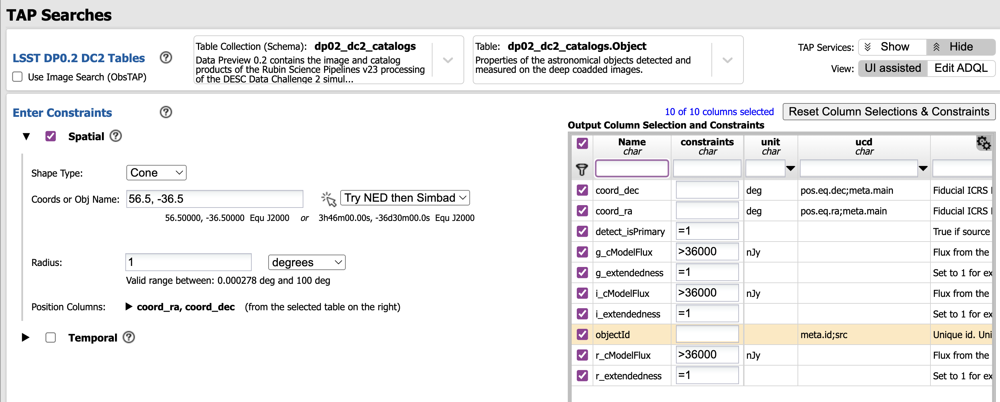
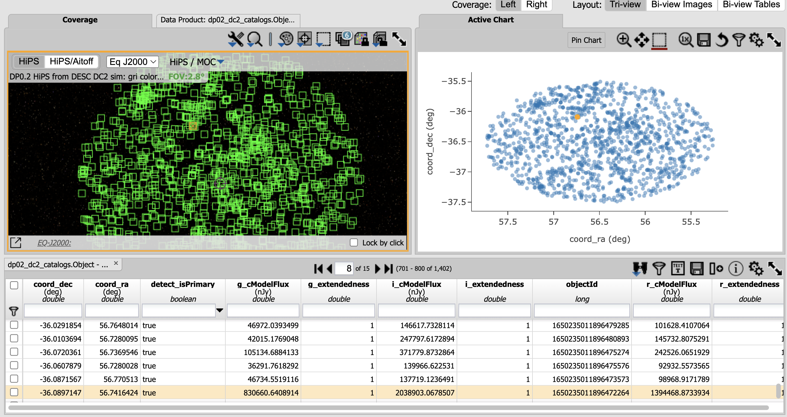
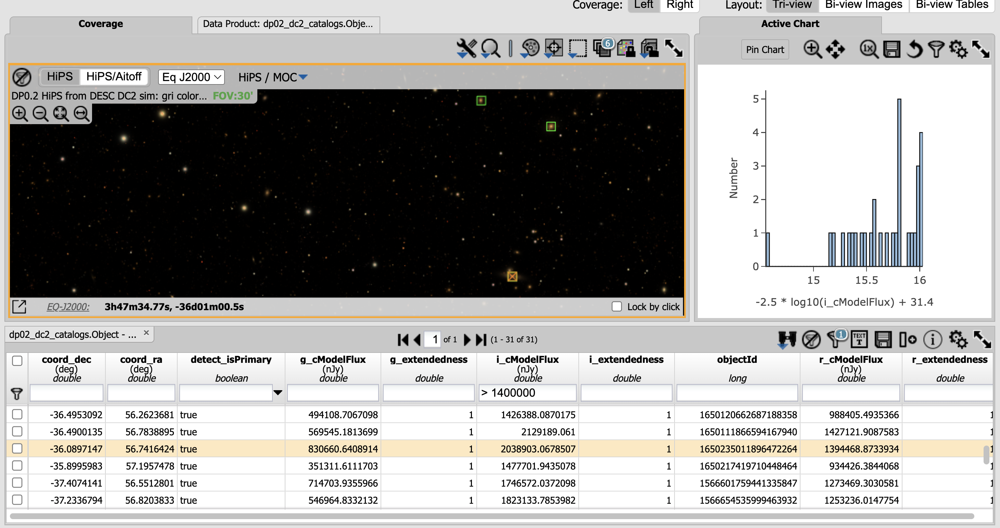

# Challenge 1: Galaxy Hunt

In the DP0.2 documentation, the first figure on the DP0.2 data products page
has three panels: the grid of tracts, the image of tract 3828, and a zoom-in
image approximately centered near a particularly bright elongated galaxy.

Use the Portal Aspect to find the `ObjectId` of that galaxy in the DP0.2 `Object` catalog.

## Resources

Introduction to the Portal Aspect <br>
https://dp0-2.lsst.io/data-access-analysis-tools/portal-intro.html

Recommended search parameters and recommended flux columns for extended objects <br>
https://dp0-2.lsst.io/data-products-dp0-2/index.html#catalogs

## Hint

Query for bright extended objects near the tract center and then visually review
the results until you spy the target.


# Solution

## Step 1: Get approximate RA, Dec of the tract center.

The referenced figure is found at this URL: 
https://dp0-2.lsst.io/data-products-dp0-2/index.html.

It has the caption that starts "Figure 15 from The LSST DESC DC2 Simulated Sky Survey...".

From the figure, infer that the target of interest has approximate coordintes of 
RA, Dec = 56.5, -36.5 in decimal degrees.

## Step 2: Execute a query for bright extended objects in the region.

In the Portal Aspect, set up a query on the Object table for all objects that are 
extended in filters *gri* within one degree of RA, Dec = 56.5, -36.5.

Reading through the text surrounding the DP0.2 catalogs description, notice that it is 
recommended to use search parameter `detect_isPrimary` = True, and include that in the query.

Below that recommendation, notice that the `cModelFlux` columns are recommended for galaxies.

We know our targeted galaxy is "particularly bright", brighter than most things, but 
maybe we don't know what that is as a magnitude. Be conservative and limit to 
20th magnitude `cModelFlux` in *gri*.

The units column of the `Object` table says flux units are nJy, and 
ABmag = -2.5 log(flux_nJy) +31.4, so that is a limit of 36,000 nJy.

Make sure to also return the `ObjectId` column.




## Step 3: Cut down on the number of galaxies for visual review.

This query has returned too many extended `Object`s for visual review.



But this is because we have underestimated the flux of the brightest galaxies.

Use the "settings" icon (double gears) to "Add New Chart", a histogram with 
"-2.5 * log10(i_cModelFlux) + 31.4" as the "column or expression". 

Notice that the "particularly bright" extended objects have *i*-band magnitudes < 16, 
which is a `cModelFlux` > 1,400,000 nJy.

In the `i_cModelFlux` column, limit to only the very brightest extended objects in
the field by typing ">1400000" in the box at the top of the column and pressing enter.

## Step 4: Visual review until the target is found.

From there, it doesn't take long to look around the image and find a familiar star pattern
from the original figure in the documentation, and the target of interest.

Click on the targeted galaxy to highlight it in the table, and get the `ObjectId`.



`ObjectId`: 1650235011896472264


# Extras

## The targeted galaxy did not seem to be over in the west part of tract 3828, like in the figure.

If you attempted to refine the approximate coordintes for the targeted galaxy
using the `CoaddPatches` table for DP0.2, you may have encountered issues.

You might have found that the targeted galaxy was not in the west side of
the tract, but nearer the middle.

I also tried this and had trouble, and I think it's because the figure that
maps out the tracts and shows the zoom-ins, the figure the challenge starts with,
is from Phase 1 of DP0 (DP0.1), and we are using the reprocessed DP0.2 now.


## Cheat code (ADQL)

To go straight to the final set of bright extended objects in the region,
and return magnitudes instead of fluxes as a bonus, this is the ADQL to use.

```
SELECT coord_dec, coord_ra, detect_isPrimary, objectId, 
       scisql_nanojanskyToAbMag(g_cModelFlux), g_extendedness, 
       scisql_nanojanskyToAbMag(r_cModelFlux), r_extendedness, 
       scisql_nanojanskyToAbMag(i_cModelFlux), i_extendedness 
FROM dp02_dc2_catalogs.Object 
WHERE CONTAINS(POINT('ICRS', coord_ra, coord_dec),CIRCLE('ICRS', 56.5, -36.5, 1))=1 
       AND (detect_isPrimary =1 
       AND g_cModelFlux >36000 AND g_extendedness =1 
       AND r_cModelFlux >36000 AND r_extendedness =1 
       AND i_cModelFlux >1400000 AND i_extendedness =1)
```