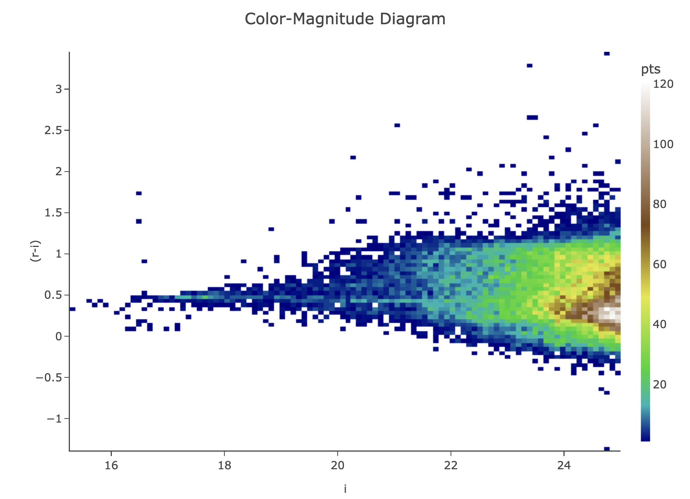
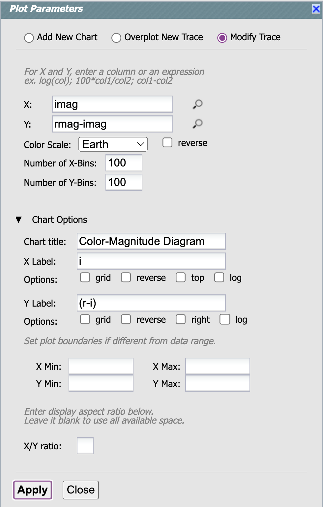

# Challenge 2: Galaxy Cluster Color-Magnitude Diagram

There is a rich galaxy cluster centered at RA, Dec = 55.75, -32.27.

Use the Portal Aspect to create an *r-i* color vs. *i*-band magnitude diagram 
for extended objects brighter than *i* = 25 mag within 0.25 deg of the cluster center.

Make it look like this, so the cluster red sequence pops out at *r-i* ~ 0.5:




## Resources

Introduction to the Portal Aspect <br>
https://dp0-2.lsst.io/data-access-analysis-tools/portal-intro.html

Recommended search parameters and recommended flux columns for extended objects <br>
https://dp0-2.lsst.io/data-products-dp0-2/index.html#catalogs

Convert fluxes to magnitudes with ADQL <br>
https://dp0-2.lsst.io/data-access-analysis-tools/adql-recipes.html#convert-fluxes-to-magnitudes


## Hints

Use ADQL and return *r* and *i* magnitude only so that the default plot is
not RA vs. Dec, but *r* vs. *i* magnitude, because this is closer to your desired plot.

It will also help you avoid this current issue: <br>
https://github.com/rubin-dp0/Support/issues/46

Portal Tutorial 04 does something similar: <br>
https://dp0-2.lsst.io/tutorials-examples/portal-4.html


# Solution

## Step 1

Use the following ADQL.

```
SELECT scisql_nanojanskyToAbMag(r_cModelFlux) as rmag,
scisql_nanojanskyToAbMag(i_cModelFlux) as imag 
FROM dp02_dc2_catalogs.Object
WHERE CONTAINS(POINT('ICRS', coord_ra, coord_dec), CIRCLE('ICRS', 55.75, -32.27, 0.25)) = 1
AND detect_isPrimary = 1
AND g_extendedness = 1
AND r_extendedness = 1
AND scisql_nanojanskyToAbMag(i_cModelFlux) < 25
```

## Step 2

Click on the "Settings" icon for the xy plot (double gears) and edit the
Plot Parameters pop-up window to be like this:


