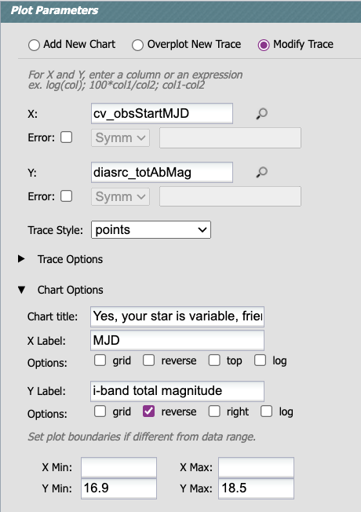

# Challenge 3: Variable Star Check

Your friend is running a star survey from their backyard telescope, from which they have 
an *i*-band limit of about 17th mag.

They ask you if the star they can sometimes detect at RA, Dec = 62.1187488 -37.0578565 is 
variable in the LSST data set.

Is it? Use the Portal Aspect to find out.

## Resources

Introduction to the Portal Aspect <br>
https://dp0-2.lsst.io/data-access-analysis-tools/portal-intro.html

The schema for the `DiaSource` table <br>
https://dm.lsst.org/sdm_schemas/browser/dp02.html#DiaSource

Portal Tutorial 02: Explore a SNIa Lightcurve <br>
https://dp0-2.lsst.io/tutorials-examples/portal-intermediate.html


## Hints

It requires a table join of `DiaSource` and `CcdVisit` to get both the difference 
image detections and the date. <br>
https://dp0-2.lsst.io/data-access-analysis-tools/adql-recipes.html#table-joins

So long as you use direct-image fluxes (not difference-image), you can convert to magnitudes. <br>
https://dp0-2.lsst.io/data-access-analysis-tools/adql-recipes.html#convert-fluxes-to-magnitudes


# Solution

## Step 1: Query the DiaSource table at the star's coordinates.

Use this ADQL query (or similar) to return the `totFlux` (direct image flux) 
and MJD for all `DiaSources` within 1 arcsecond of the coordinates your
friend gave you, for visits in the *i*-band only.


```
SELECT cv.obsStartMJD AS cv_obsStartMJD, 
       scisql_nanojanskyToAbMag(diasrc.totFlux) AS diasrc_totAbMag 
FROM dp02_dc2_catalogs.DiaSource AS diasrc 
JOIN dp02_dc2_catalogs.CcdVisit AS cv ON diasrc.ccdVisitId = cv.ccdVisitId
WHERE CONTAINS(POINT('ICRS', diasrc.coord_ra, diasrc.coord_dec),
               CIRCLE('ICRS', 62.1187488, -37.0578565, 0.00027)) = 1 
      AND diasrc.filterName = 'i'
```

The default xy plot will be the total AB magnitude in the direct (non-difference) images for
all visits in which there was a detection in the difference image, vs. MJD.

You'll be able to see straight away that yes, the star is variable and has a 
maximum brightness of about 17th mag.


## Step 2: Make a nicer lightcurve to send to your friend.




